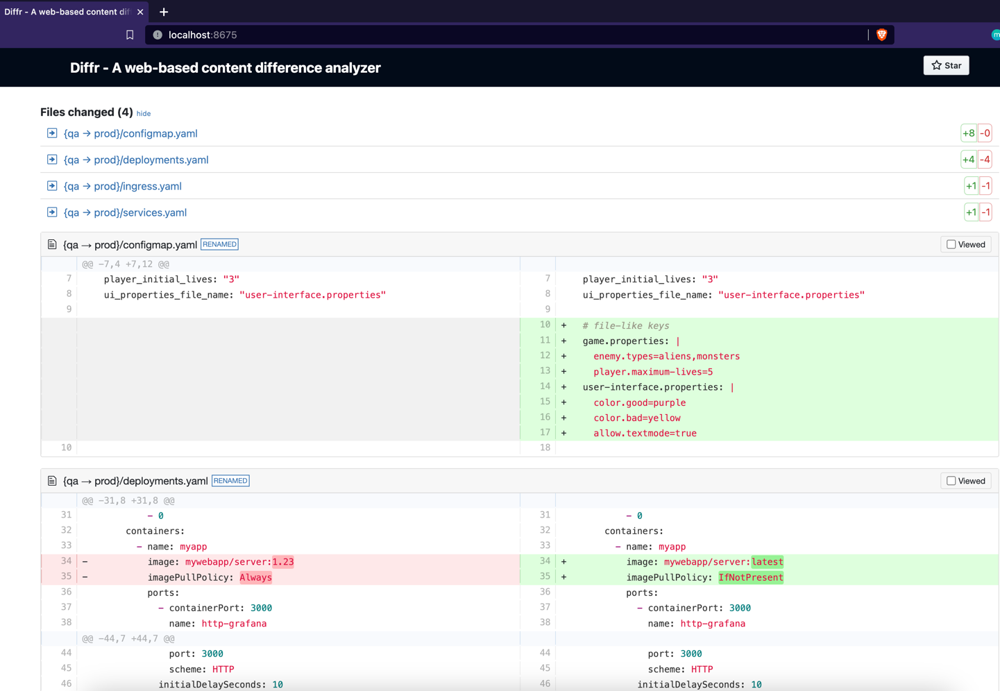

# Diffr - Simplifying Directory and File Content Comparison


[](https://github.com/imrajdas/diffr/stargazers)
[]()

Diffr compares two directories or files and shows what changed, what was added, and what was removed. By default it opens a local web UI. You can also print a unified diff, write a patch, or emit JSON for scripts and CI.

Visit the project on GitHub: [https://github.com/imrajdas/diffr](https://github.com/imrajdas/diffr)



## Table of Contents

- [Installation](#installation)
- [Build](#build)
- [Usage](#usage)
- [What Diffr compares](#what-diffr-compares)
- [Web UI](#web-ui)
- [Ignore rules](#ignore-rules)
- [Commands](#commands)
- [Flags](#flags)
- [Examples](#examples)
- [Exit codes](#exit-codes)
- [Contributing](#contributing)
- [License](#license)

## Installation

Diffr is designed to be cross-platform and should work on various operating systems, including:

* Linux
* macOS
* Windows

### Homebrew

```bash
brew tap imrajdas/tap
brew install imrajdas/tap/diffr
```

Homebrew 6 requires trusting a third-party cask. The fully qualified name does that for `diffr` only.

### GitHub Releases

Download the latest archive for your OS from [GitHub Releases](https://github.com/imrajdas/diffr/releases).

### Linux/macOS

* Extract the binary

```shell
tar -zxvf diffr_<VERSION>_<OS>_<ARCH>.tar.gz
```

* Provide necessary permissions

```shell
chmod +x diffr
```

* Move the diffr binary to /usr/local/bin/diffr

```shell
sudo mv diffr /usr/local/bin/diffr
```

* Run Diffr on Linux/macOS:

```shell
diffr [dir1/file1] [dir2/file2] [flags]
```

### Windows

* Extract the zip archive
* Run `diffr.exe version` to confirm the install

## Build

You need [Go](https://golang.org/) 1.26.6 or later.

```bash
git clone https://github.com/imrajdas/diffr
cd diffr
go build -o diffr .

./diffr --help
```

## Usage

Compare two directories or two files:

```bash
diffr [dir1/file1] [dir2/file2] [flags]
```

Without `--stdout`, `--json`, or `--patch`, Diffr starts a local web server (default `http://localhost:8675`) and opens it in your browser. Use `--no-open` to skip launching the browser.

You can also use the command to access specific features:

```bash
diffr [command]
```

## What Diffr compares

Diffr walks **both** trees and reports:

- **changed** files present on both sides
- **added** files only in the right tree
- **removed** files only in the left tree
- **identical** files (counted, not listed)

File types are handled separately:

- **Text** — unified diffs, shown side-by-side in the UI
- **Images** (PNG, JPEG, GIF) — pixel comparison with a left/right slider
- **PDFs** — page count and extracted text
- **Binaries** — size/hash comparison, never dumped as text

## Web UI

The browser view includes:

- A summary of changed, added, removed, and identical files
- Filter by filename, extension, or status
- Side-by-side vs unified toggle
- Dark mode
- Image overlay slider (pixel diff is optional)
- PDF and binary summaries (PDF text diffs stay on the PDF row)

## Ignore rules

By default Diffr skips `.git`, `node_modules`, `__pycache__`, and a few other junk paths.

It also applies, in order:

1. Built-in excludes (unless `--no-default-exclude`)
2. `.diffrignore` in the current directory and at the root of each compared tree (gitignore syntax)
3. `.gitignore` from the git root of each tree (unless `--no-gitignore`)
4. `--exclude` / `-e` patterns (repeatable)
5. `--ignore-file` for an extra ignore file

Example `.diffrignore`:

```
*.log
dist/
vendor/
```

## Commands

Diffr supports the following commands:

- `help`: Displays help information about any command.
- `version`: Displays the version of Diffr.

## Flags

| Flag | Description |
| --- | --- |
| `-a, --address string` | Bind address for the web server (host or URL). Default: `http://localhost` |
| `-p, --port int` | Port for the web server. Default: `8675` |
| `--stdout` | Print a unified diff to stdout instead of starting the web UI |
| `--json` | Print a JSON report to stdout instead of starting the web UI |
| `--patch string` | Write a unified patch to a file (`-` for stdout) instead of starting the web UI |
| `--no-open` | Do not open a browser when starting the web UI |
| `-C, --context int` | Unified-diff context lines. Default: `3` |
| `-w, --ignore-whitespace` | Do not report files that differ only in whitespace |
| `-i, --ignore-case` | Do not report files that differ only in case |
| `-e, --exclude stringArray` | Gitignore-style glob to exclude (repeatable) |
| `--ignore-file string` | Path to a `.diffrignore` file |
| `--no-default-exclude` | Do not apply built-in excludes |
| `--no-gitignore` | Do not apply `.gitignore` from git repositories |
| `-h, --help` | Display help |

`--stdout` uses color when stdout is a TTY. Set `NO_COLOR=1` for plain text. `--patch` files are always uncolored.

## Examples

```bash
# Compare two directories in the browser
diffr /path/to/dir1 /path/to/dir2

# Compare two files
diffr /path/to/file1 /path/to/file2

# CLI unified diff (like diff -r)
diffr /path/to/dir1 /path/to/dir2 --stdout

# JSON report for CI
diffr /path/to/dir1 /path/to/dir2 --json

# Write a patch file
diffr /path/to/dir1 /path/to/dir2 --patch out.patch

# Serve the UI without opening a browser
diffr /path/to/dir1 /path/to/dir2 --no-open

# Listen on all interfaces
diffr /path/to/dir1 /path/to/dir2 -a 0.0.0.0 -p 9000 --no-open

# Ignore whitespace-only changes and extra paths
diffr /path/to/dir1 /path/to/dir2 --stdout -w -e '*.log' -e 'vendor'

# Try the bundled demo trees
diffr testdata/demo/left testdata/demo/right
```

## Exit codes

When using `--stdout`, `--json`, or `--patch`:

| Code | Meaning |
| --- | --- |
| `0` | No differences |
| `1` | Differences found |
| `2` | Error |

## Contributing

Contributions to Diffr are welcomed and encouraged! If you find a bug or have a feature request, please open an issue on the [GitHub repository](https://github.com/imrajdas/diffr). If you'd like to contribute code, feel free to fork the repository and submit a pull request.

## License

Diffr is released under the [Apache](LICENSE). You are free to use, modify, and distribute this software in accordance with the terms of the license.
