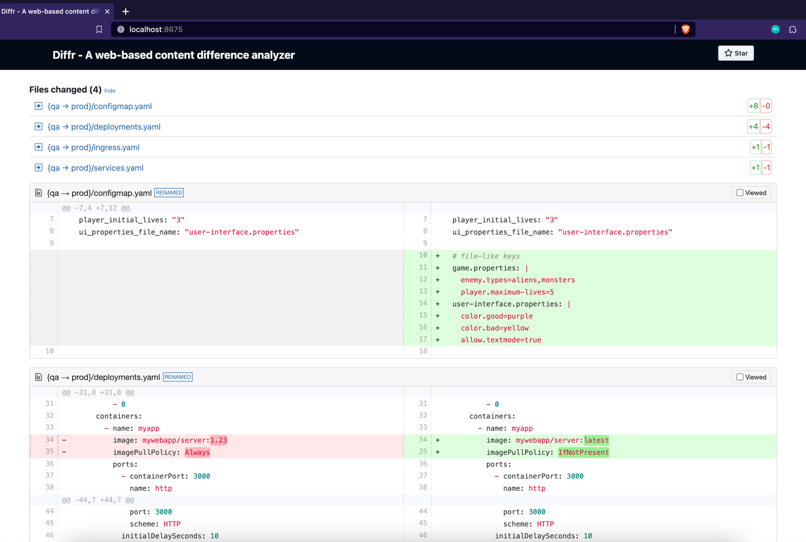

# Diffr - Simplifying Directory and File Content Comparison


[](https://github.com/imrajdas/diffr/stargazers)
[]()


Diffr is an open-source web-based tool designed to make comparing content differences between two directories, and even files, a simple and intuitive process. Whether you're a developer comparing source code, a designer comparing image assets, or anyone dealing with files, Diffr provides a user-friendly interface to quickly identify changes and similarities between directories and files.

Visit the project on GitHub: [https://github.com/imrajdas/diffr](https://github.com/imrajdas/diffr)



## Table of Contents

- [Installation](#installation)
- [Build](#build)
- [Usage](#usage)
- [Commands](#commands)
- [Flags](#flags)
- [Examples](#examples)
- [Contributing](#contributing)
- [License](#license)

## Installation

Diffr is designed to be cross-platform and should work on various operating systems, including:

* Linux
* macOS
* Windows

Download the latest release for your operating system from here- [https://github.com/imrajdas/diffr/releases](https://github.com/imrajdas/diffr/releases)

### Linux/MacOS

* Extract the binary

```shell
tar -zxvf diffr-<OS>-<ARCH>-<VERSION>.tar.gz
```

* Provide necessary permissions

```shell
chmod +x diffr
```

* Move the diffr binary to /usr/local/bin/diffr

```shell
sudo mv diffr /usr/local/bin/diffr
```

* Run Diffr on Linux/MacOS:

```shell
diffr [dir1/file1] [dir2/file2] [flags]
```

### Windows

* Extract the Binary from the Zip Archive

* Check the Diffr Version

```shell
diffr.exe <command> <subcommand> <subcommand> [options and parameters]
```

* To check the version of the diffr:

```shell
diffr version
```

## Build

To use Diffr, you need to have [Go](https://golang.org/) installed on your system. Once you have Go set up, you can install Diffr using the following command:

```bash
git clone https://github.com/imrajdas/diffr
go get -v
go build main.go -o diffr

./diffr --help
```

## Usage

Diffr simplifies the process of comparing content differences between two directories or files. The basic usage is as follows:

```bash
diffr [dir1/file1] [dir2/file2] [flags]
```

You can also use the command to access specific features:

```bash
diffr [command]
```

## Commands

Diffr supports the following commands:

- `help`: Displays help information about any command.
- `version`: Displays the version of Diffr.

## Flags

Diffr provides the following flags to customize its behavior:

- `-a, --address string`: Set the address for the web server to listen on. The default is `http://localhost`.
- `-h, --help`: Display help information about Diffr.
- `-p, --port int`: Set the port for the web server to listen on. The default is `8675`.

## Examples

Here are some examples of how to use Diffr:

```bash
# Compare contents of two directories
diffr /path/to/dir1 /path/to/dir2

# Compare contents of two files
diffr /path/to/file1 /path/to/file2

# Compare contents with custom server address and port
diffr /path/to/dir1 /path/to/dir2 -a http://127.0.0.1 -p 9000
```

## Contributing

Contributions to Diffr are welcomed and encouraged! If you find a bug or have a feature request, please open an issue on the [GitHub repository](https://github.com/imrajdas/diffr). If you'd like to contribute code, feel free to fork the repository and submit a pull request.

## License

Diffr is released under the [Apache](LICENSE). You are free to use, modify, and distribute this software in accordance with the terms of the license.

---

Diffr makes directory and file content comparison hassle-free, allowing you to focus on identifying differences rather than dealing with complex tools. Give it a try, and make directory and file comparison a breeze!
